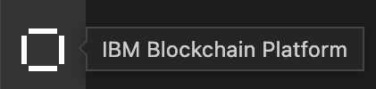
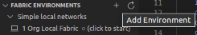
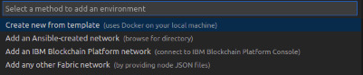
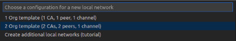

# amazon-tracing

*Framework* para rastreamento de geolocalização de espécimes de fauna e flora utiliznado **tecnologia de livro-razão** distribuído (***Distributed Ledger Technology***).

## Pré-requisitos

- ***Visual Studio Code* (versão ^1.55.0)**;
- Extensão ***IBM Blockchain Platform*** para o ***Visual Studio Code*** (versão 1.0.40);
- ***Dokcer*** versão **v.17.06.2-ce** ou superior;

### Dependências opcionais

- ***Node*** **v10** (**v10.15.3** ou superior) ou **v12** (**v12.13.1** ou superior) e ***npm*** **v6.x** ou superior.

## Criação e inicialização da rede Fabric

- Abrir a extensão **IBM Blockchain Platform** no editor **Visual Studio Code**;

- Clicar sobre **Adicionar Ambiente (*Add Environment*)**;

- Selecionar **Criar uma nova a partir de modelo (*Create new from template*)**;

- Selecionar ***2 Org template (2 CAs, 2 peers, 1 channel)***;

- Digite um nome para o ambiente (guarde este, pois deverá ser usado futuramente);

