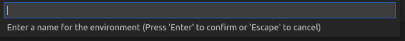

# amazon-tracing

*Framework* para rastreamento de geolocalização de espécimes de fauna e flora utiliznado **tecnologia de livro-razão** distribuído (***Distributed Ledger Technology***).

## Pré-requisitos

- ***Visual Studio Code* (versão ^1.55.0)**;
- Extensão ***IBM Blockchain Platform*** para o ***Visual Studio Code*** (versão 1.0.40);
- ***Dokcer*** versão **v.17.06.2-ce** ou superior;

### Dependências opcionais

- ***Node*** **v10** (**v10.15.3** ou superior) ou **v12** (**v12.13.1** ou superior) e ***npm*** **v6.x** ou superior.

## Criação e inicialização da rede Fabric

- Abrir a extensão **IBM Blockchain Platform** no editor **Visual Studio Code**;

- Clicar sobre o botão **Adicionar Ambiente (*Add Environment*)**, situado no canto superior direito da aba ***Fabric Environments***;

- Selecionar a primeira opção - **Criar uma nova a partir de modelo (*Create new from template*)**;

- Selecionar a segunda opção - ***2 Org template (2 CAs, 2 peers, 1 channel)***;

- Digite um nome para o ambiente (guarde este, pois deverá ser usado futuramente);

## Gerenciamento do contrato inteligente

### Encapsulamento do contrato inteligente

Se ainda não existe um pacote do contrato inteligente gerado, proceder da seguinte forma:

- Abra o ***Visual Studio Code*** da pasta ***Chaincode**;
- Clicar sobre o botão ***More Actions***, no canto superior da aba ***Smart Contracts***;

- Clicar sobre o botão ***Package Open Project*** na caixa de diálogo que surgirá.

**Obs.:** Para o correto funcionamento do processo, deve-se gerar o pacote com uma versão ainda não existente na aba ***Smart Contracts***, caso contrário, resultará em erro. Tal parâmetro é definido no arquivo **package.json**, situado na raiz do projeto.

### Instalação do contrato inteligente

Assegure que a extensão esteja conectada ao ambiente ***TwoOrgEnv***. Caso não esteja, faça-o segundo  seguinte instrução:

- Clique sobre o nome do ambiente ***TwoOrgEnv*** na aba ***Fabric Environments***. Isso solicitará a conexão da extensão ao ambiente automaticamente.

Com o ambiente conectado:

- Clique sobre o botão ***+ Install***;
- 

- Selecione os *peers* nos quais será instalado o contrato inteligente (no caso, todos os *peers* da rede);

- Selecione o pacote do contrato inteligente gerado na seção anterior.

